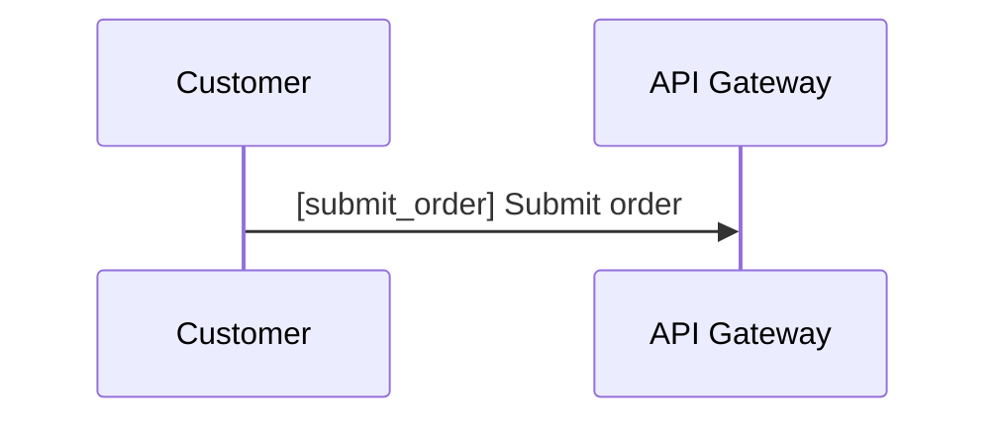

# diagram-tours

`diagram-tours` lets you open supported Mermaid diagrams from any local repository and view them in a browser, with optional `*.tour.yaml` files to enrich the walkthrough.

It currently supports Mermaid flowcharts, Mermaid sequence diagrams, and common Mermaid Sankey diagrams. You can load them from:

- [Flowchart examples](examples/flowchart/) with `.mmd` or `.tour.yaml` pairs
- [Sequence examples](examples/sequence/)
- [Sankey examples](examples/sankey/)
- Markdown files with fenced `mermaid` blocks, including AI-generated docs
- optional matching `*.tour.yaml` files for authored enrichment

## Install Globally

```bash
npm install -g diagram-tours
```

```bash
bun add -g diagram-tours
```

## Run On Your Repo

Fastest path to first value: point `diagram-tours` at any Mermaid file, Markdown file with fenced Mermaid blocks, or a directory that contains them. Authored `*.tour.yaml` files are optional enrichment, not a prerequisite.

If discovery finds invalid authored tours, the valid tours still load and the player surfaces the skipped authored files through the `Issues` panel with actionable diagnostics, including line and column when available.

Start in the current directory with the interactive wizard:

```bash
diagram-tours
```

The current directory must already contain at least one supported input such as `.mmd`, `.mermaid`, `.md` with fenced Mermaid, or `*.tour.yaml`. If nothing valid is found, startup fails with a clear error instead of opening an empty browser session.

Open a directory directly:

```bash
diagram-tours ./docs/architecture
```

Open a single tour file directly:

```bash
diagram-tours ./examples/flowchart/checkout-payment-flow.tour.yaml
```

Open a single Mermaid diagram directly:

```bash
diagram-tours ./examples/flowchart/checkout-payment-flow.mmd
```

Open a Markdown file that contains Mermaid fences directly:

```bash
diagram-tours --open ./docs/interview-offers-pipeline.md
```

For direct targets, pass `--open` or open the printed localhost URL manually. Direct mode does not launch the browser by default.

The server prefers `http://127.0.0.1:7733` and automatically falls back to another free localhost port when needed.

## Wizard Flow

Running `diagram-tours` with no arguments starts a console wizard that can:

1. open the current directory
2. open another directory
3. open a single diagram or `*.tour.yaml` file

The wizard also asks whether to open the browser and lets you override the host or port.

## Direct Path Flow

When you pass a directory, Mermaid file, Markdown file with fenced Mermaid, or `*.tour.yaml` path directly:

- the wizard is skipped
- the target is validated immediately
- the local URL is printed
- the browser does not open unless you ask for it with `--open`

## Validate Tours

Use `diagram-tours validate` to check one authored tour target or one directory tree without starting the browser:

```bash
diagram-tours validate
diagram-tours validate ./examples
diagram-tours validate ./examples/flowchart/checkout-payment-flow.tour.yaml
```

- no args means `.`.
- folders are recursive.
- output stays short and actionable.
- one issue per line.

## Key Flags

```text
diagram-tours [target?] [--host <value>] [--port <value>] [--open|--no-open]
```

- `--host <value>` sets the bind host
- `--port <value>` uses an explicit port and fails clearly if it is unavailable
- `--open` opens the browser after startup
- `--no-open` forces browser opening off

## Authoring Helpers

The published CLI also includes authoring-oriented commands:

```bash
diagram-tours setup
diagram-tours init ./examples/flowchart/checkout-payment-flow.mmd
diagram-tours init ./docs/interview-offers-pipeline.md
diagram-tours init ./fixtures/markdown/checklist.md#details
diagram-tours init ./examples/flowchart/new-flow.tour.yaml
diagram-tours validate
diagram-tours validate ./examples
diagram-tours validate ./examples/flowchart/checkout-payment-flow.tour.yaml
```

- `diagram-tours setup` creates `.diagram-tours/instructions.md` and can optionally install a Codex subagent definition that points back to that file. Run it with no flags for the interactive flow, or use `--agent`, `--agent-path <path>`, `--no-agent`, and `--overwrite` directly.
- `diagram-tours init <target>` scaffolds authored tours in one of two ways. Point it at `.mmd`, `.mermaid`, or `.md` to derive an editable `*.tour.yaml` from an existing diagram source, or point it at a new `*.tour.yaml` path to create a valid starter tour plus a sibling `.mmd` diagram. Use `--overwrite` if you want to replace an existing scaffold.
- `diagram-tours validate [target]` validates one authored `*.tour.yaml` file or all authored tours under a directory tree. With no target, it validates the current directory recursively.

## Diagrams And Tour Files

Raw diagrams work immediately. If a diagram has no authored tour yet, `diagram-tours` generates a fallback walkthrough automatically:

- an overview step for the whole diagram
- one step per addressable Mermaid diagram element in source order

For flowcharts, that means one step per Mermaid node. For sequence diagrams, that means one step per explicit participant plus one step per explicitly tagged message. For Sankey diagrams, that means one step per Sankey node in source order.

Sankey diagrams use `sankey-beta` with CSV-like rows. In authored tours, Sankey `focus` values and `{{text references}}` use raw visible node labels such as `Gateway` or `Fraud Review`. If the same visible label appears more than once, the first source-order match wins.

Add a `*.tour.yaml` file only when you want richer titles, custom step text, curated focus groups, and label interpolation.

For repo-local AI and authoring conventions, you can commit `.diagram-tours/instructions.md` and keep it as the stable file that agents and contributor docs reference.

Markdown files with fenced `mermaid` blocks work too. If one Markdown file contains multiple Mermaid blocks, `diagram-tours` generates one entry per block. Authored tours can target a specific block with a fragment such as `diagram: ./checklist.md#details`.

Version 1 tour files look like this:

```yaml
version: 1
title: Payment Flow
diagram: ./flowchart/checkout-payment-flow.mmd

steps:
  - focus:
      - api_gateway
    text: >
      The {{api_gateway}} is the public entry point.
```

The player resolves `{{api_gateway}}` to the Mermaid node label, highlights the focused nodes, and keeps the current step in the URL with `?step=`.

## Sequence Diagrams

Sequence diagrams are supported too. To make a message addressable from `focus` or `{{references}}`, begin the Mermaid message label with `[message_id] `:



That makes both `focus: [submit_order]` and `{{submit_order}}` resolve to `Submit order`.

## Contributors

Use [AGENTS.md](AGENTS.md) as the default implementation policy.

- [Contributor Workflow](docs/contributor-workflow.md)
- [Principles Index](docs/principles/README.md)

The shipped example library is grouped by diagram type under `examples/`: [flowchart](examples/flowchart/), [sequence](examples/sequence/), and [sankey](examples/sankey/). Inside those folders, `checkout-payment-flow` is a small authored flowchart, `flowchart-addressability` covers addressable flowchart shapes and bare endpoints, `sequence-order-sequence` is a small authored sequence diagram, `payments-platform-overview` is a large authored demo, and `sankey-ops-review` is an interview-to-offer Sankey walkthrough.

## Repository Packages

```text
packages/
  cli/         published global CLI
  core/        shared domain types
  parser/      Mermaid + YAML loading and validation
  web-player/  packaged SvelteKit runtime used by the CLI
```
