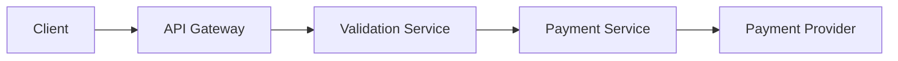

# Diagram Tour

Diagram Tour is an open-source framework for **explainable diagrams**.

It allows you to create **guided, step-by-step explanations for Mermaid diagrams** using a simple YAML tour definition. Instead of static architecture diagrams, you can provide interactive walkthroughs that highlight components and explain system flows.

## Example

Mermaid diagram:



Tour definition:

```yaml
version: 1
title: Payment Flow
diagram: ./payment-flow.mmd

steps:
  - focus:
      - api_gateway
    text: >
      The {{api_gateway}} is the public entry point for requests from {{client}}.

  - focus:
      - validation_service
    text: >
      The {{validation_service}} verifies the request before it continues.
```

Diagram Tour renders this as a **guided explanation** that highlights nodes and walks the user through the system step by step.

## Core Concepts

### Mermaid Diagram

Diagram Tour works on Mermaid diagrams.

Nodes must have **stable IDs** so the tour can reference them.

Example:

```mermaid
api_gateway[API Gateway]
```

### Tour Definition

A YAML file defines the walkthrough.

Each step contains:

- nodes to focus
- explanation text

References inside text use:

```
{{node_id}}
```

Example:

```
The {{api_gateway}} forwards the request to {{validation_service}}.
```

These references resolve automatically to the **Mermaid label**.

## Repository Structure

```
packages/
  core/        domain model and tour engine
  parser/      YAML + Mermaid parsing
  web-player/  UI for running tours

examples/
  sample tours

fixtures/
  test fixtures
```

## Project Goals (v1)

- Guided tours for Mermaid flowcharts
- YAML tour definitions
- Highlight focused nodes
- Step-by-step explanation text
- Simple web player

## Non-goals (v1)

- audio narration
- branching tours
- multi-diagram tours
- complex animations

## Development

This project uses:

- Bun
- TypeScript
- strict lint rules
- TDD workflow

Before contributing, read:

- AGENTS.md
- ENGINEERING_PLAYBOOK.md
- REPO_WORK_RULES.md
- DELIVERY_CHECKLIST.md
