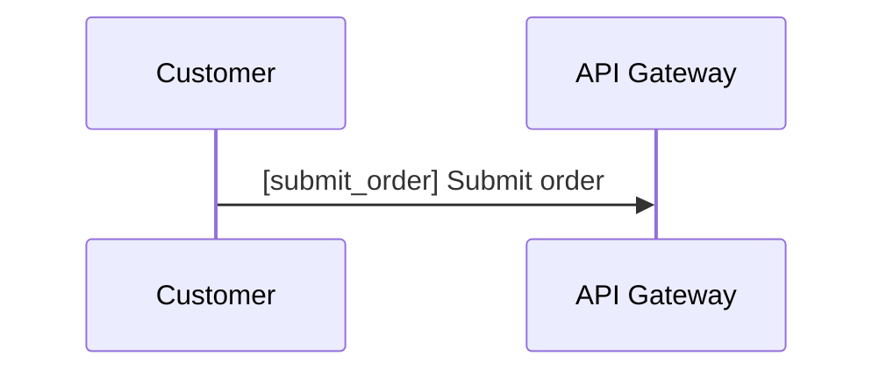

# diagram-tours

`diagram-tours` lets you open Mermaid diagrams from any local repository and view them in a browser, with optional `*.tour.yaml` files to enrich the walkthrough.

It can load:

- Mermaid diagram files such as `payment-flow.mmd` or `release-pipeline.mermaid`
- Mermaid flowcharts and Mermaid sequence diagrams
- Markdown files with fenced `mermaid` blocks, including AI-generated docs
- optional matching `*.tour.yaml` files
- version 1 tour content with `version`, `title`, `diagram`, and `steps` when you want authored enrichment

## Install Globally

```bash
npm install -g diagram-tours
```

```bash
bun add -g diagram-tours
```

## Run On Your Repo

Fastest path to first value: point `diagram-tours` at any Mermaid file, Markdown file with fenced Mermaid blocks, or a directory that contains them. Authored `*.tour.yaml` files are optional enrichment, not a prerequisite.

Start in the current directory with the interactive wizard:

```bash
diagram-tours
```

The current directory must already contain at least one supported input such as `.mmd`, `.mermaid`, `.md` with fenced Mermaid, or `*.tour.yaml`. If nothing valid is found, startup fails with a clear error instead of opening an empty browser session.

Open a directory directly:

```bash
diagram-tours ./docs/architecture
```

Open a single tour file directly:

```bash
diagram-tours ./examples/checkout/payment-flow.tour.yaml
```

Open a single Mermaid diagram directly:

```bash
diagram-tours ./examples/checkout/payment-flow.mmd
```

Open a Markdown file that contains Mermaid fences directly:

```bash
diagram-tours ./docs/architecture/country-implementation-checklist.md
```

The server prefers `http://127.0.0.1:7733` and automatically falls back to another free localhost port when needed.

## Wizard Flow

Running `diagram-tours` with no arguments starts a console wizard that can:

1. open the current directory
2. open another directory
3. open a single diagram or `*.tour.yaml` file

The wizard also asks whether to open the browser and lets you override the host or port.

## Direct Path Flow

When you pass a directory, Mermaid file, or `*.tour.yaml` path directly:

- the wizard is skipped
- the target is validated immediately
- the local URL is printed
- the browser does not open unless you ask for it with `--open`

## Key Flags

```text
diagram-tours [target?] [--host <value>] [--port <value>] [--open|--no-open]
```

- `--host <value>` sets the bind host
- `--port <value>` uses an explicit port and fails clearly if it is unavailable
- `--open` opens the browser after startup
- `--no-open` forces browser opening off

## Diagrams And Tour Files

Raw diagrams work immediately. If a diagram has no authored tour yet, `diagram-tours` generates a fallback walkthrough automatically:

- an overview step for the whole diagram
- one step per addressable Mermaid diagram element in source order

For flowcharts, that means one step per Mermaid node. For sequence diagrams, that means one step per explicit participant plus one step per explicitly tagged message.

Add a `*.tour.yaml` file only when you want richer titles, custom step text, curated focus groups, and label interpolation.

Markdown files with fenced `mermaid` blocks work too. If one Markdown file contains multiple Mermaid blocks, `diagram-tours` generates one entry per block. Authored tours can target a specific block with a fragment such as `diagram: ./checklist.md#details`.

Version 1 tour files look like this:

```yaml
version: 1
title: Payment Flow
diagram: ./payment-flow.mmd

steps:
  - focus:
      - api_gateway
    text: >
      The {{api_gateway}} is the public entry point.
```

The player resolves `{{api_gateway}}` to the Mermaid node label, highlights the focused nodes, and keeps the current step in the URL with `?step=`.

## Sequence Diagrams

Sequence diagrams are supported too. To make a message addressable from `focus` or `{{references}}`, begin the Mermaid message label with `[message_id] `:



That makes both `focus: [submit_order]` and `{{submit_order}}` resolve to `Submit order`.

## For Contributors

Repository development still uses the Bun workspace monorepo:

```bash
bun install
bun run dev
bun run dev:open
bun run dev:interactive
```

- `bun run dev` starts the local player without opening the browser automatically.
- `bun run dev:open` starts the same local player and opens the browser for you.
- `bun run dev:interactive` starts the console flow for choosing the preview target interactively.

Contributor guidance lives here:

- [AGENTS.md](AGENTS.md)

Operational docs:

- [Runtime Loading](docs/runtime-loading.md)
- [Authoring Guide](docs/authoring-guide.md)
- [Adoption And Onboarding Notes](docs/adoption-onboarding.md)
- [Coverage Dashboard](docs/testing/coverage.md)
- [Smoke Tests](docs/testing/smoke-tests.md)
- [Architecture Overview](docs/architecture/overview.md)
- [Tour Specification v1](docs/tour-spec-v1.md)
- [Vision Log](VISION_LOG.md)

## Testing And Coverage

Agent default:

- targeted local checks on touched files/packages
- operator runs exhaustive/full validation

Operator quick path:

```bash
bun run allchecks:ai
```

`allchecks:ai` is the human-facing alias for the full validation pass (`prepush`) with normal logs.

Other available commands:

- `bun run lint`
- `bun run typecheck`
- `bun run test`
- `bun run smoke`
- `bun run smoke:full`
- `bun run prepush`

The example library is grouped into topical folders such as `checkout/`, `navigation/`, `ops/`, `sequence/`, and `support/` so the repo browser stays readable.

## Repository Packages

```text
packages/
  cli/         published global CLI
  core/        shared domain types
  parser/      Mermaid + YAML loading and validation
  web-player/  packaged SvelteKit runtime used by the CLI
```
