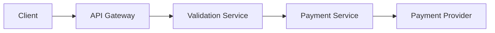

# Diagram Tour

Diagram Tour is an open-source framework for explainable diagrams.

It lets you pair Mermaid diagrams with YAML tour definitions so people can move through a system one step at a time instead of reading a static diagram cold.

## Current Capabilities

The repository currently provides:

- Mermaid flowchart parsing with stable node IDs
- YAML tour parsing and validation
- recursive discovery of `*.tour.yaml` files from a directory
- single-file preview for authoring workflows
- slug-based routing for multiple tours
- deep links to specific steps through `?step=`
- step text with `{{node_id}}` label interpolation
- semantic focus steps, including multi-focus and empty-focus steps
- a Svelte web player with guided navigation
- theme persistence across reloads and direct links
- guided recovery for unknown tour routes
- smoke coverage for viewport behavior and large-diagram scenarios

## Quick Example

Mermaid diagram:



Tour definition:

```yaml
version: 1
title: Payment Flow
diagram: ./payment-flow.mmd

steps:
  - focus:
      - api_gateway
    text: >
      The {{api_gateway}} is the public entry point for requests from {{client}}.

  - focus:
      - validation_service
    text: >
      The {{validation_service}} verifies the request before it continues.
```

The player resolves `{{api_gateway}}` to `API Gateway`, highlights the selected focus targets, and lets readers move through the tour step by step.

## Tour Model

Version 1 tour files contain:

- `version`
- `title`
- `diagram`
- `steps`

Each step contains:

- `focus`
- `text`

`focus` references Mermaid node IDs. `text` can reference those same IDs with `{{node_id}}`, which resolves to the node label from the diagram.

An empty focus array is valid:

```yaml
focus: []
```

That means the step has no specific node emphasis. The player may use that for a reset, overview, or neutral context moment.

Full contract details live in [docs/tour-spec-v1.md](docs/tour-spec-v1.md).

## Repository Structure

```text
packages/
  core/        shared domain types
  parser/      YAML + Mermaid loading, parsing, validation, discovery
  web-player/  Svelte UI for interactive tours

examples/
  reference tours and stress fixtures

docs/
  product, architecture, runtime, and authoring docs
```

## Example Tours

The repository ships with a small example library that doubles as product reference material and regression coverage.

| Example | Purpose |
| --- | --- |
| `payment-flow` | Baseline guided architecture walkthrough |
| `refund-flow` | Additional linear product-style flow |
| `decision-flow` | Branch-heavy Mermaid structure |
| `incident-response` | Operational walkthrough example |
| `parallel-onboarding` | Parallel path explanation |
| `release-pipeline` | Delivery pipeline tour |
| `support-decision-tree` | Decision-tree style diagram |
| `viewport-stability` | Empty-focus and viewport stability fixture |
| `viewport-centering` | Top, bottom, grouped, and neutral focus viewport checks |
| `huge-system` | Large stress-test tour for dense diagrams and label readability |

## Local Development

Install dependencies:

```bash
bun install
```

Start the web player against the default `examples/` directory:

```bash
bun run dev
```

Start the web player against an explicit directory or tour file:

```bash
bun run dev ./examples
bun run dev ./examples/payment-flow/payment-flow.tour.yaml
```

Use the interactive startup helper when you want a guided CLI menu:

```bash
bun run dev:interactive
```

Preview a single tour file directly:

```bash
DIAGRAM_TOUR_SOURCE_TARGET=./examples/payment-flow/payment-flow.tour.yaml bun run dev
```

PowerShell:

```powershell
$env:DIAGRAM_TOUR_SOURCE_TARGET = "./examples/payment-flow/payment-flow.tour.yaml"
bun run dev
```

Preview a custom examples directory:

```bash
DIAGRAM_TOUR_SOURCE_TARGET=./examples bun run dev
```

PowerShell:

```powershell
$env:DIAGRAM_TOUR_SOURCE_TARGET = "./examples"
bun run dev
```

If you run smoke tests locally for the first time, install Chromium once:

```bash
bunx playwright install chromium
```

## Commands

- `bun run lint`
- `bun run typecheck`
- `bun run test`
- `bun run smoke`
- `bun run build`
- `bun run dev`
- `bun run dev:interactive`

## CI

GitHub Actions currently validates pull requests and `main` with:

- `bun install --frozen-lockfile`
- `bun run lint`
- `bun run typecheck`
- `bun run test`
- `bunx playwright install --with-deps chromium`
- `bun run smoke`
- `bun run build`

That means CI covers static checks, unit coverage, browser smoke coverage, and production buildability.

## Documentation

Start here when working in the repo:

- [AGENTS.md](AGENTS.md)
- [ENGINEERING_PLAYBOOK.md](ENGINEERING_PLAYBOOK.md)
- [REPO_WORK_RULES.md](REPO_WORK_RULES.md)
- [DELIVERY_CHECKLIST.md](DELIVERY_CHECKLIST.md)

Then use the product docs:

- [Tour Specification v1](docs/tour-spec-v1.md)
- [Architecture Overview](docs/architecture/overview.md)
- [Runtime Loading](docs/runtime-loading.md)
- [Authoring Guide](docs/authoring-guide.md)
- [ADR 0001: Runtime Loading and Focus Semantics](docs/adr/0001-runtime-loading-and-focus-semantics.md)

## Development Expectations

Diagram Tour is developed in an AI-assisted workflow with delivery mode as the default operating model.

The repository expects:

- contracts first
- strong guardrails
- clear tests
- 100% coverage for statements, branches, functions, and lines
- separation of responsibilities across packages
- documentation updates when behavior or contracts change
