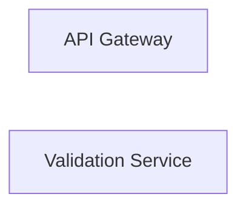
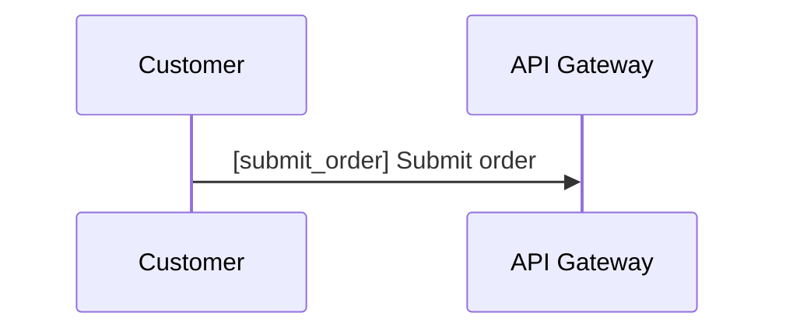
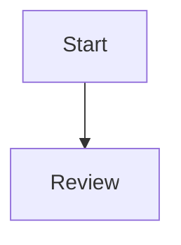
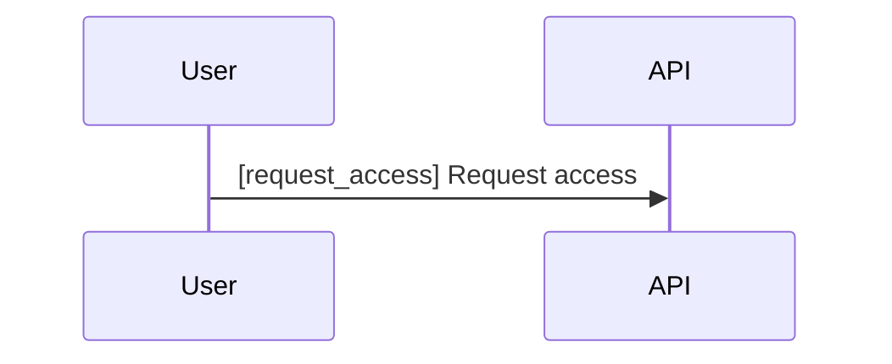

# Authoring Guide

This guide describes the current best practices for writing Diagram Tour examples and product tours.

`diagram-tours` can open a raw Mermaid diagram without a tour file. Author a `*.tour.yaml` when you want to enrich that default generated walkthrough with curated steps and prose.

It also supports Markdown files that contain fenced ```mermaid blocks. This is especially useful when AI tools place diagrams inside `.md` files instead of standalone `.mmd` files.

## Start with Stable Mermaid IDs

Every diagram element that may appear in `focus` or `{{references}}` needs a stable, addressable Mermaid ID.

Use readable, stable IDs:



Prefer:

- lowercase snake_case
- IDs that survive label rewrites
- IDs that describe the role, not the current copy

Avoid:

- generated-looking IDs
- IDs that depend on presentation wording
- renaming IDs just because the label changed

For sequence diagrams, participants must be declared explicitly and addressable messages must start with `[message_id] ` inside the message text:



In that example:

- `customer` and `api` are participant IDs
- `submit_order` is the message ID
- the user-facing label for `submit_order` is `Submit order`

## Keep Tour Text Label-Friendly

Step text can interpolate Mermaid labels with `{{diagram_element_id}}`.

Example:

```yaml
text: >
  The {{api_gateway}} forwards valid requests to {{validation_service}}.
```

That keeps the authored copy tied to the diagram label without repeating display names manually.

The same pattern works for sequence participants and tagged messages:

```yaml
text: >
  {{submit_order}} is the first request that leaves {{customer}} and reaches {{api}}.
```

## Use Focus Intentionally

`focus` is semantic, not a low-level camera instruction.

Use a single focus target when one node should carry the explanation:

```yaml
focus:
  - api_gateway
```

Use multiple focus targets when the relationship between nodes matters more than either node alone:

```yaml
focus:
  - payment_service
  - payment_provider
```

Use `focus: []` when the step should reset attention, summarize, or let the reader absorb the full diagram:

```yaml
focus: []
```

For sequence diagrams, `focus` may contain participant IDs or tagged message IDs:

```yaml
focus:
  - submit_order
```

## Write Linear, Readable Steps

Version 1 tours are linear. A good step usually does one of these things:

- introduce one component
- explain one handoff
- summarize one phase
- reset context before the next section

If a step tries to explain too much, split it.

## Organize Tour Files

The current convention is one directory per example:

```text
examples/checkout/
  payment-flow.mmd
  payment-flow.tour.yaml
  refund-flow.mmd
  refund-flow.tour.yaml
```

That layout produces a clean slug and keeps related files together.

If you only have a diagram at first, this is still valid:

```text
examples/checkout/
  payment-flow.mmd
```

The runtime will generate an overview step plus one step per addressable Mermaid diagram element until you add an authored tour file.

For flowcharts, that is one step per node. For sequence diagrams, that is one step per explicit participant plus one step per explicitly tagged message.

Markdown-backed diagrams are also valid:

````md
# Country Implementation Checklist


````

If a Markdown file contains more than one Mermaid block, `diagram-tours` will generate one entry per block. An authored tour that targets one of those blocks should use a fragment:

```yaml
diagram: ./country-implementation-checklist.md#review
```

Markdown fences can contain sequence diagrams too:

````md
# Support Sequence


````

## Validate Common Failure Cases

The parser rejects:

- missing required root fields
- empty `steps`
- non-array `focus`
- empty or invalid diagram-element IDs in `focus`
- unknown diagram-element references in `focus`
- unknown diagram-element references in `text`
- duplicate sequence participant/message IDs inside one sequence diagram

Error messages include the source path and step number when possible, so keep steps small enough for that context to stay useful.

## Authoring Workflow

A practical local loop is:

1. start the player against the target you want to edit
2. iterate on Mermaid and YAML together
3. run `bun run test`
4. run `bun run smoke` if viewport or interaction behavior changed

For the published product flow, use the global CLI:

```bash
diagram-tours ./examples/checkout/payment-flow.tour.yaml
diagram-tours ./examples/checkout/payment-flow.mmd
diagram-tours ./fixtures/markdown/checklist.md
diagram-tours ./examples
diagram-tours
```

For repository contributor work, the Bun helpers still exist:

```bash
bun run dev ./examples/checkout/payment-flow.tour.yaml
bun run dev ./examples/checkout/payment-flow.mmd
bun run dev ./examples
bun run dev:open
bun run dev:interactive
```

The environment-variable flow still works when you want to drive the runtime directly:

PowerShell example:

```powershell
$env:DIAGRAM_TOUR_SOURCE_TARGET = "./examples/checkout/payment-flow.tour.yaml"
bun run dev
```

## Example Fixtures

Use the repository examples as references:

- `payment-flow` for a simple baseline tour
- `order-sequence` for authored Mermaid sequence diagrams
- `support-handoff` for generated fallback on a raw sequence diagram
- `viewport-stability` for empty-focus behavior
- `viewport-centering` for grouped and edge-position focus behavior
- `huge-system` for large diagrams and dense label conditions
