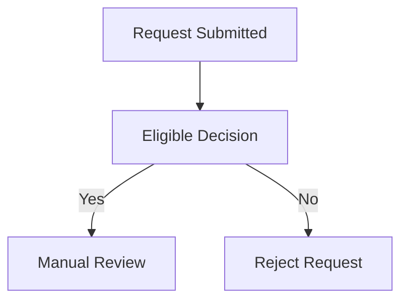

---

# Diagram Tours — Project Overview

## Vision

**Diagram Tours** is a developer-oriented tool for turning technical diagrams into **interactive guided walkthroughs**.

Instead of static diagrams, authors can attach **step-by-step explanations** directly to nodes inside diagrams. The result is a **navigable, visual narrative** that helps readers understand complex systems.

The experience is similar to a **visual presentation layer on top of diagrams**, where:

* the diagram remains the primary artifact
* steps progressively highlight parts of the system
* explanations guide the reader through the architecture

The long-term goal is to create a **diagram-native documentation format**.

---

# Core Concept

A **diagram tour** consists of:

1. A diagram (currently **Mermaid**)
2. A tour file describing steps
3. A player that renders the diagram and guides the reader

Example flow:

```
diagram.mmd
tour.yaml
↓
parser
↓
resolved tour
↓
web-player
↓
interactive diagram walkthrough
```

---

# Authoring Model

Authors write:

### 1️⃣ Diagram

Example:



---

### 2️⃣ Tour Definition

Example:

```yaml
title: Decision Flow

steps:
  - focus: [A]
    text: |
      The request enters the system.

  - focus: [B]
    text: |
      The system evaluates eligibility.

  - focus: [C, D]
    text: |
      The request is either reviewed or rejected.
```

Each step:

* highlights nodes
* optionally references nodes in the explanation
* moves the viewport to the relevant part of the diagram

---

# Architecture

The project is split into three main packages.

```
packages/
 ├── parser
 ├── core
 └── web-player
```

---

# Parser

Responsible for:

* reading Mermaid diagrams
* extracting node identifiers
* validating tour references
* resolving steps into a normalized format

Responsibilities include:

* validating focus nodes
* validating node references in text
* detecting invalid tours
* producing a **resolved tour structure**

The parser is the **single source of truth for author validation**.

---

# Core

Shared domain logic:

* tour model
* collection model
* step representation
* resolved node references

This layer is **UI-independent** and used by the player.

---

# Web Player

The **interactive UI** that renders tours.

Current stack:

* **SvelteKit**
* **Mermaid rendering**
* browser-based viewport control

Responsibilities:

* rendering diagrams
* handling navigation between steps
* highlighting focused nodes
* controlling viewport position
* managing UI overlays

---

# Key Features Implemented

## Step-Based Navigation

Users navigate tours step by step:

```
Previous
Next
```

Steps highlight diagram elements and provide explanation.

---

## Deep Linking

Steps are addressable via URL.

Example:

```
/decision-flow?step=3
```

Behavior:

* `step` is **1-based**
* invalid values are clamped
* refresh preserves state

---

## Node Highlighting

Each step highlights nodes using DOM hooks:

```
data-node-id
data-focus-state
```

States:

```
focused
dimmed
default
```

This creates visual hierarchy.

---

## Multi-Node Focus

Steps can focus multiple nodes simultaneously.

The player computes a **focus group bounding box** to guide viewport movement.

---

## Viewport Control

The player automatically repositions the diagram viewport to keep focused nodes visible.

Behavior:

Single focus:

```
center node
```

Multi focus:

```
compute combined bounds
center group
```

Viewport movement is **pan-based**, not zoom-based.

---

## Canvas-First Layout

The UI has recently been redesigned to follow a **diagram-first workspace model**.

Principles:

```
diagram = primary content
everything else = overlays
```

Inspired by tools like:

* Lucidchart
* Figma
* Miro

---

### Current UI Structure

```
Top Bar
 ├─ Diagram Tours
 ├─ Browse
 ├─ christianguzman.uk
 └─ Theme toggle

Workspace Canvas
 ├─ Mermaid diagram
 ├─ Step overlay
 ├─ Tour identity chip
 └─ Future overlays
```

The diagram now owns the entire body region below the top bar.

---

# Current UX Elements

## Step Overlay

A floating card showing:

```
Step number
Explanation
Previous / Next controls
```

Position:

```
bottom-right (desktop)
```

Responsive adjustments planned for smaller screens.

---

## Browse Panel

Allows selecting tours.

Current version:

```
modal / floating panel
flat list of tours
```

Future versions will likely evolve into a **tree explorer**.

---

## Theme Support

Both:

```
Dark mode
Light mode
```

Dark mode is currently the more polished theme.

---

# Testing

The project enforces strong testing guarantees.

Requirements:

```
100% test coverage
lint passing
typecheck passing
build passing
smoke tests passing
```

Smoke tests verify:

* tour loading
* deep linking
* diagram rendering
* step navigation
* viewport behavior
* theme switching

---

# Current Focus

Recent work has been focused on:

1. **Viewport centering**
2. **Multi-focus behavior**
3. **Highlight hierarchy**
4. **Canvas-first layout**
5. **Overlay UI architecture**

---

# Known Issues

Some areas are still evolving:

### Viewport stability

Edge cases with:

* extremely large diagrams
* nodes far apart
* measurement timing

---

### Highlight hierarchy

Edge labels and connectors still need refinement.

---

### Layout polish

The visual hierarchy between:

```
diagram
step overlay
tour identity
```

still needs tuning.

---

# Planned Features

## Minimap

Small navigation map of the diagram.

Similar to:

```
Figma minimap
Lucidchart navigator
```

Allows quick orientation.

---

## Timeline

Visual representation of tour steps.

Possible formats:

```
horizontal step bar
progress track
node-based timeline
```

Allows jumping between steps.

---

## Node Click Navigation

Clicking a node could:

```
jump to the first step focusing that node
```

This turns the diagram into an **interactive entry point**.

---

## Explorer Navigation

Replace the flat Browse list with a **project-based tree**.

Based on file structure:

```
examples/
  payments/
  onboarding/
  architecture/
```

Resulting in a navigation similar to:

```
VSCode explorer
docs site tree
```

---

## Editor Preview

Improve author workflow.

Allow previewing:

```
bun run dev path/to/tour.yaml
```

or

```
bun run dev directory/
```

This enables fast iteration.

---

## Author Diagnostics

Improve error reporting:

Examples:

```
unknown focus node
invalid step
unknown node reference
missing fields
```

Errors should include:

```
file path
step number
field context
```

---

## Advanced Viewport Features

Future improvements may include:

* optional zoom-to-fit
* animated transitions
* smarter group centering
* viewport constraints

---

# Long-Term Direction

Diagram Tours aims to become a **diagram-native documentation format**.

Potential evolution:

```
diagram files
+
tour files
+
interactive viewer
```

This enables:

* architecture walkthroughs
* system onboarding
* operational runbooks
* educational diagram narratives

The ultimate goal is to make **diagrams executable explanations** rather than static visuals.

---

# Project Philosophy

The project follows a few core principles:

### Diagram-first

The diagram is the primary artifact.

---

### Minimal author friction

Writing tours should remain simple:

```
diagram + yaml
```

No heavy configuration.

---

### Visual clarity

The player should emphasize:

```
focus
context
explanation
```

without overwhelming the diagram.

---

### Strong developer tooling

The project prioritizes:

```
type safety
test coverage
clean architecture
```

---

# Current Status

The system is **functional and stable**, with:

* working parser
* validated tours
* interactive player
* deep linking
* viewport control
* canvas-first layout

The focus now is on **UX refinement and advanced navigation capabilities**.

---

