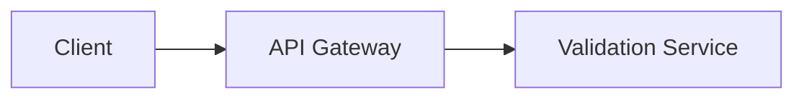
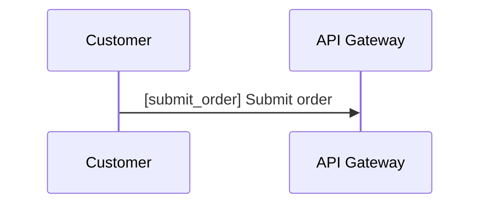

# Tour Specification v1

This document defines version 1 of the Diagram Tour contract.

A tour is a guided walkthrough over a Mermaid diagram. Version 1 is intentionally small, linear, and predictable.

This document describes the authored YAML contract. The runtime can also generate fallback tours directly from Mermaid diagrams when no YAML tour is present, but that generation behavior is not part of the `tour.yaml` schema itself.

Changes to this contract must be accompanied by updated tests and synchronized documentation.

## Goals

Version 1 prioritizes:

- simplicity
- readability
- predictable parsing
- easy authoring

## File Format

Tours are authored as YAML when you want to enrich a Mermaid diagram with curated steps.

Example:

```yaml
version: 1
title: Payment Flow
diagram: ./checkout-payment-flow.mmd

steps:
  - focus:
      - api_gateway
    text: >
      The {{api_gateway}} receives requests from {{client}}.

  - focus:
      - validation_service
    text: >
      The {{validation_service}} verifies the request before processing.
```

## Root Fields

### `version`

Required.

```yaml
version: 1
```

Only version `1` is supported.

### `title`

Required.

```yaml
title: Payment Flow
```

Must be a non-empty string.

### `diagram`

Required.

```yaml
diagram: ./checkout-payment-flow.mmd
```

Must be a non-empty string path to a Mermaid diagram source.

Supported authored targets include:

- standalone Mermaid files such as `./checkout-payment-flow.mmd`
- Markdown files with fenced Mermaid blocks such as `./country-checklist.md`

If a Markdown file contains multiple Mermaid blocks, the path must include a fragment that selects one block:

```yaml
diagram: ./country-checklist.md#details
```

The referenced diagram must contain addressable Mermaid element IDs.

For flowcharts, that means explicit node IDs such as:

```mermaid
api_gateway[API Gateway]
```

For sequence diagrams, that means:

- explicit participant or actor declarations such as `participant api as API Gateway`
- explicit message IDs inside the message text such as `api->>db: [validate_request] Validate request`

### `steps`

Required.

```yaml
steps:
  - ...
```

Must be a non-empty array.

Tours are linear in version 1. Branching is not supported.

## Step Fields

Each step must be an object with:

- `focus`
- `text`

Example:

```yaml
- focus:
    - api_gateway
  text: >
    The {{api_gateway}} receives requests from {{client}}.
```

### `focus`

Required.

```yaml
focus:
  - api_gateway
  - validation_service
```

Rules:

- must be an array
- may contain zero or more diagram-element IDs
- each entry must be a non-empty string
- each ID must exist in the Mermaid diagram

Valid examples:

```yaml
focus: []
```

```yaml
focus:
  - api_gateway
```

```yaml
focus:
  - payment_service
  - payment_provider
```

`focus: []` is valid and represents a step with no specific diagram-element emphasis. A player may use that for an overview, neutral state, or context reset.

### `text`

Required.

```yaml
text: >
  The {{api_gateway}} receives requests from {{client}}.
```

Must be a non-empty string.

The text may reference diagram elements through inline references.

## Diagram Element References

Inside step text, diagram-element references use this syntax:

```text
{{node_id}}
```

Example:

```text
The {{api_gateway}} sends the request to {{validation_service}}.
```

Resolution behavior:

1. locate the referenced diagram-element ID in the Mermaid diagram
2. read the element label
3. replace the reference with that label

Example:

```text
The {{api_gateway}} forwards requests.
```

becomes:

```text
The API Gateway forwards requests.
```

## Validation Rules

A tour is invalid if any of the following are true:

- the document root is not an object
- `version` is missing
- `version` is not `1`
- `title` is missing
- `title` is not a non-empty string
- `diagram` is missing
- `diagram` is not a non-empty string
- `steps` is missing
- `steps` is not an array
- `steps` is empty
- a step is not an object
- `focus` is not an array
- a `focus` entry is empty or not a string
- a `focus` entry references an unknown Mermaid diagram element ID
- `text` is missing
- `text` is not a non-empty string
- `text` references an unknown Mermaid diagram element ID

Errors should be descriptive and actionable.

The current parser includes contextual information such as the tour source path and, when relevant, the step number and field.

Example:

```text
Tour "examples/checkout-payment-flow.tour.yaml": step 2 focus references unknown Mermaid node id "validation"
```

## Mermaid Requirements

Version 1 supports Mermaid flowcharts and Mermaid sequence diagrams.

Flowchart nodes must use explicit IDs:



In this example, the usable IDs are:

```text
client
api_gateway
validation_service
```

Sequence diagrams support two addressable element kinds:

- participants declared with `participant` or `actor`
- messages whose labels begin with `[message_id] `

Example:



In this example, the usable IDs are:

```text
customer
api
submit_order
```

The user-facing label for `submit_order` is `Submit order`.

Within one sequence diagram, addressable participant IDs and message IDs must be unique across the whole diagram.

## Focus Semantics

The `focus` field is semantic, not a strict UI instruction.

The contract says which diagram elements matter for a step. The player decides how to render that meaning.

Typical UI behavior may include:

- highlighting focused nodes
- highlighting focused participants or messages
- dimming non-focused nodes
- centering the viewport
- keeping an overview when focus is empty

The specification intentionally does not mandate one rendering strategy.

## Scope of Version 1

Supported:

- Mermaid flowcharts
- Mermaid sequence diagrams with addressable participants and tagged messages
- YAML tour files
- sequential tours
- element highlighting or other player-defined focus rendering
- inline diagram-element references in text
- empty-focus steps

Not supported:

- branching tours
- multiple diagrams in one tour
- audio narration
- conditional steps
- player-specific viewport instructions in the tour file
- Mermaid notes, activation bars, loops, alt blocks, and other non-addressable sequence constructs

## Future Directions

Potential future features include:

- branching tours
- audio narration
- step identifiers
- multi-diagram tours
- interactive steps
- plugin extensions

These are intentionally excluded from version 1.

## Philosophy

Version 1 aims to feel like writing an explanation, not configuring a UI runtime.
