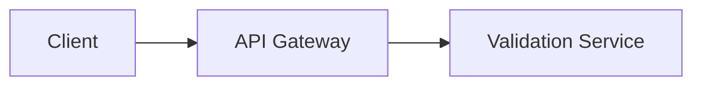

# Tour Specification v1

This document defines the **version 1 format of a Diagram Tour definition**.

A tour describes a **guided walkthrough of a Mermaid diagram**.

The format is intentionally minimal for the first version.

---

# Goals of v1

The first version of the specification focuses on:

- simplicity
- readability
- predictable parsing
- easy authoring

A tour should be easy to write and easy to understand.

---

# Tour File Format

Tours are defined using **YAML**.

Example:

```yaml
version: 1
title: Payment Flow
diagram: ./payment-flow.mmd

steps:
  - focus:
      - api_gateway
    text: >
      The {{api_gateway}} receives requests from {{client}}.

  - focus:
      - validation_service
    text: >
      The {{validation_service}} verifies the request before processing.
```

---

# Root Fields

## version

```
version: 1
```

Required.

Defines the specification version.

Only version `1` is supported in this document.

---

## title

```
title: Payment Flow
```

Required.

Human readable name of the tour.

Used for display purposes.

---

## diagram

```
diagram: ./payment-flow.mmd
```

Required.

Path to a Mermaid diagram file.

The diagram must contain nodes with **explicit IDs**.

Example Mermaid node:

```mermaid
api_gateway[API Gateway]
```

The node ID (`api_gateway`) is used by the tour system.

---

## steps

```
steps:
  - ...
```

Required.

An ordered list of tour steps.

The order defines the progression of the tour.

Tours are **linear in version 1**.

Branching is not supported.

---

# Step Format

Each step must contain:

```
focus
text
```

Example:

```yaml
- focus:
    - api_gateway
  text: >
    The {{api_gateway}} receives requests from {{client}}.
```

---

## focus

```
focus:
  - api_gateway
  - validation_service
```

Required.

Defines which diagram nodes should be emphasized in this step.

Rules:

- Must be an array
- Can contain zero or more node IDs
- Each ID must exist in the Mermaid diagram

Valid examples:

```
focus: []
```

```
focus:
  - api_gateway
```

```
focus:
  - payment_service
  - payment_provider
```

---

## text

```
text: >
  The {{api_gateway}} receives requests from {{client}}.
```

Required.

Human readable explanation shown during the step.

The text may reference diagram nodes using **inline references**.

---

# Node References

Inside text, nodes are referenced using the following syntax:

```
{{node_id}}
```

Example:

```
The {{api_gateway}} sends the request to {{validation_service}}.
```

The system resolves these references by:

1. locating the node ID in the Mermaid diagram
2. retrieving the node label
3. replacing the reference with the label

Example transformation:

```
The {{api_gateway}} forwards requests.
```

becomes:

```
The API Gateway forwards requests.
```

---

# Validation Rules

A tour is considered invalid if:

- `version` is missing
- `version` is not `1`
- `title` is missing
- `diagram` is missing
- `steps` is missing
- `steps` is empty
- `focus` references a node that does not exist
- `text` references a node that does not exist

Errors should be **descriptive and actionable**.

Example error:

```
Unknown Mermaid node id "validation" referenced in step 2
```

---

# Mermaid Requirements

Version 1 supports **Mermaid flowcharts**.

Nodes must use **explicit IDs**.

Example:



IDs used by the tour:

```
client
api_gateway
validation_service
```

---

# Behavior of Focus

The `focus` field expresses **semantic focus**, not a specific UI effect.

The player decides how to render focus.

Typical behavior may include:

- highlighting focused nodes
- dimming the rest of the diagram
- centering the viewport

However, this is **not mandated by the specification**.

---

# Scope of Version 1

Supported:

- Mermaid flowcharts
- YAML tour files
- sequential tours
- node highlighting
- inline node references in text

Not supported:

- branching tours
- multiple diagrams
- audio narration
- animations
- conditional steps

---

# Future Versions

Possible future features include:

- branching tours
- audio narration
- step identifiers
- multi-diagram tours
- interactive steps
- plugin extensions

These features are intentionally excluded from version 1.

---

# Philosophy

The specification prioritizes:

- simplicity
- readability
- minimal authoring overhead

Tours should feel like **writing explanations**, not configuring software.
