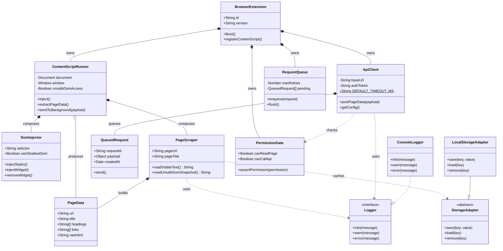

# Browser Extension Data Pipeline

This example shows a browser extension that injects UI into a page, reads visible
content from the DOM, and posts structured data to an API.

```mermaid
classDiagram

class BrowserExtension {
  +String id
  +String version
  +Boot()
  +registerContentScript()
}

class ContentScriptRunner {
  -Document document
  -Window window
  -Boolean unsafeDomAccess
  +inject()
  +extractPageData()
  +sendToBackground(payload)
}

class DomInjector {
  +String selector
  +Boolean useShadowDom
  +injectStyles()
  +injectWidget()
  +removeWidget()
}

class PageScraper {
  +String pageUrl
  +String pageTitle
  +readVisibleText() String
  +readUnsafeDomSnapshot() String
}

class ApiClient {
  -String baseUrl
  -String authToken
  +String DEFAULT_TIMEOUT_MS$
  +postPageData(payload)
  +getConfig()
}

class RequestQueue {
  -Number maxRetries
  -QueuedRequest[] pending
  +enqueue(request)
  +flush()
}

class QueuedRequest {
  +String requestId
  +Object payload
  +Date createdAt
  +send()
}

class PageData {
  +String url
  +String title
  +String[] headings
  +String[] links
  +String rawHtml
}

class Logger {
  <<interface>>
  +info(message)
  +warn(message)
  +error(message)
}

class ConsoleLogger {
  +info(message)
  +warn(message)
  +error(message)
}

class PermissionGate {
  +Boolean canReadPage
  +Boolean canCallApi
  +assertPermission(permission)
}

class StorageAdapter {
  <<abstract>>
  +save(key, value)
  +load(key)
  +remove(key)
}

class LocalStorageAdapter {
  +save(key, value)
  +load(key)
  +remove(key)
}

BrowserExtension *-- ContentScriptRunner : owns
BrowserExtension *-- ApiClient : owns
BrowserExtension *-- RequestQueue : owns
BrowserExtension *-- PermissionGate : owns

ContentScriptRunner *-- DomInjector : composes
ContentScriptRunner *-- PageScraper : composes
ContentScriptRunner o-- PageData : produces

PageScraper *-- PageData : builds
PageScraper ..> Logger : uses
PageScraper ..> StorageAdapter : caches

ApiClient *-- QueuedRequest : queues
ApiClient ..> Logger : uses
ApiClient ..> PermissionGate : checks

ConsoleLogger ..|> Logger
LocalStorageAdapter --|> StorageAdapter
```
